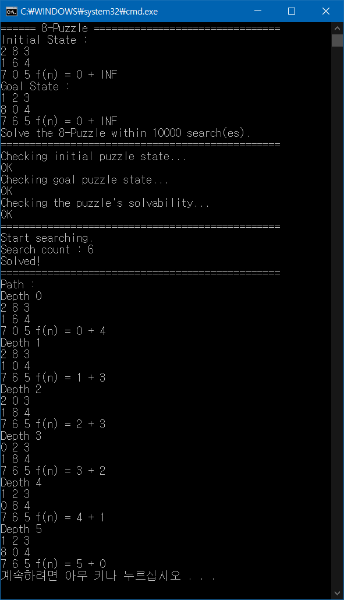

8-puzzle problem
===========

## 부경대학교 컴퓨터공학과 인공지능 강의 과제#2

 * 과제 : A* 알고리즘을 구현하여 8-puzzle puzzle을 해결하자.  
 * 사용 언어 : C#  

## 1. 문제 파악
 
### A* 알고리즘

```
A* 알고리즘은 주어진 출발 꼭짓점에서부터 목표 꼭짓점까지 가는 최단 경로를 찾아내는 그래프/트리 탐색 알고리즘 중 하나이다. 이 알고리즘은 각 꼭짓점 x에 대해 그 꼭짓점을 통과하는 최상의 경로를 추정하는 순위값인 "휴리스틱 추정값" h(x)을 매기는 방법을 쓴다. 이 알고리즘은 이 휴리스틱 추정값의 순서로 꼭짓점을 방문한다.
```
(Ref. [위키백과 A* 알고리즘 문서](https://ko.wikipedia.org/wiki/A*_%EC%95%8C%EA%B3%A0%EB%A6%AC%EC%A6%98))

A* 알고리즘은 각 노드에서 목표 노드까지 도달하는데 필요한 비용을 추정한 값을 사용해 다음 경로를 선택하는 알고리즘이다. 최적 경로를 위한 선택은 평가 함수 f(n)를 통해 정해지고 이 평가 함수 f(n)는 다음 식으로 정의된다.
```
f(n) = g(n) + h(n)
g(n) : 현재까지의 비용
h(n) : 앞으로 예상되는 비용
```

### 8-puzzle에의 적용
  
8-puzzle에서 노드는 퍼즐의 현재 상태가 된다. 현재 노드의 자식 노드는 현재 퍼즐의 상태에서 움직일 수 있는 새로운 경로가 된다. 평가 함수 f(n)은 다음과 같이 표현할 수 있다.  
```
f(n) = g(n) + h(n)
g(n) : 현재까지 이동한 횟수
h(n) : 퍼즐의 목표 상태와 현재 상태를 비교했을 때 서로 다른 칸의 개수
```

## 2. 구현
### class EPNode (EPNode.cs)  
8 퍼즐의 상태에 대한 정보를 저장하는 클래스.

Constructor :
 * `EPNode(int[,] matrix, int x, int y, int level, EPNode parent)`
    * `matrix` : 8 퍼즐의 상태를 나타내는 2차원 배열
    * `x` : 빈 칸의 x 좌표
    * `y` : 빈 칸의 y 좌표
    * `level` : 시작 노드로부터의 거리
    * `parent` : 부모 노드

Properties :
 * `Parent` : 부모 노드
 * `Distance` : 시작 노드로부터의 거리
 * `Heuristic` : 목표 노드까지의 추정치(초기값 = INF)
 * `Matrix` : 8 퍼즐의 상태를 나타내는 2차원 배열

APIs :
 * `EPNode MoveUp()`
 * `EPNode MoveDown()`
 * `EPNode MoveLeft()`
 * `EPNode MoveRight()` : 현재 노드의 퍼즐을 해당 방향으로 이동시킨 상태를 새 노드 인스턴스로 반환, 이동 불가 시 `null` 반환
 * `EPNode Estimate(int[,] goal)` : 목표 노드에 대한 현재 노드의 추정치 계산
 * `EPNode Print()` : 현재 노드 출력

! `Estimate`와 `Print()`의 반환 타입을 `EPNode`로 지정한 이유:  
  
`this`를 리턴하기 때문에 테스트 하기에 편합니다.

### class EightPuzzle (EightPuzzle.cs)
EPNode를 가지고 8 퍼즐 문제를 푸는 클래스. (EightPuzzle **has-a** EPNode)

Constructor :
 * `EightPuzzle(int[,] initial, int[,] goal, int limit)`
    * `initial` : 초기 상태
    * `goal` : 목표 상태
    * `limit` : 탐색 한도 (무한 루프를 방지, 유의미하게 큰 값)

Property :
 * `DEBUG` : 탐색 과정의 출력 여부 (default = false)

APIs :
 * `static int PrintPath(EPNode node)` : node에서 시작 상태까지의 경로 출력
 * `bool Solve()` : A* 알고리즘을 사용해 8 퍼즐 문제 풀이 시작

## 3. 실행
### 코드

```
static void Main(string[] args)
{
    Console.WriteLine("====== 8-Puzzle ================================");

    int[,] initial = new int[,] { { 2, 8, 3 }, { 1, 6, 4 }, { 7, 0, 5 } };
    int[,] goal = new int[,] { { 1, 2, 3 }, { 8, 0, 4 }, { 7, 6, 5 } };
    int limit = 10000;

    Console.WriteLine("Initial State : ");
    new EPNode(initial, 0, 0, 0, null).Print();
    Console.WriteLine("Goal State : ");
    new EPNode(goal, 0, 0, 0, null).Print();

    Console.WriteLine("Solve the 8-Puzzle within " + limit + " search(es).");
    Console.WriteLine("================================================");

    EightPuzzle puzzle = new EightPuzzle(initial, goal, limit)
    {
        DEBUG = false
    };
    EPNode result = puzzle.Solve();

    if ( result != null )
    {
        Console.WriteLine("Solved!");
        Console.WriteLine("================================================");
        Console.WriteLine("Path : ");
        EightPuzzle.PrintPath(result);
    }
    else
    {
        Console.WriteLine("Failed!");
    }
}
```

### 결과
  

## 4. 고려할 점
```
initial = { { 3, 8, 1 }, { 6, 2, 5 }, { 0, 4, 7 } }
goal    = { { 1, 2, 3 }, { 8, 0, 4 }, { 7, 6, 5 } }
```
  
위 입력은 해결 불가능한 사례이다. 이러한 상황에 대한 예외 처리가 따로 필요하다.  

```
Fact 1: For a grid of odd width, the polarity of the number of inversions is invariant.
That means: all legal moves preserve the polarity of the number of inversions.
```
(Ref 1. https://www.cs.bham.ac.uk/~mdr/teaching/modules04/java2/TilesSolvability.html)  
(Ref 2. https://stackoverflow.com/questions/36108269/does-8-puzzle-solvability-rules-work-for-any-goal-state)  

8 퍼즐에서 큰 수가 작은 수 보다 먼저 나오는 경우를 **도치(Inversion)** 라고 정의한다. N*N 퍼즐 문제에서 N이 홀수일 때는 도치의 극성(짝수/홀수)은 이동에 상관 없이 항상 같다. 즉, 만약 초기 상태와 목표 상태 모두 도치의 개수가 짝수 혹은 홀수로 동일할 경우, 해당 퍼즐은 해결 가능하다.  
따라서 해결 불가능한 입력이 주어졌을 땐 다음과 같이 출력된다.  


#
anteater333@github
